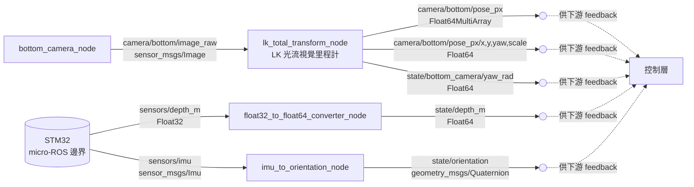
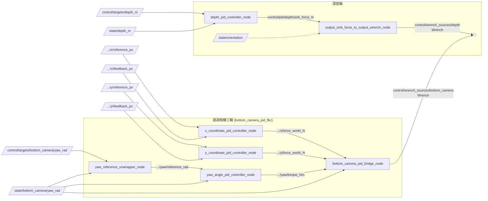
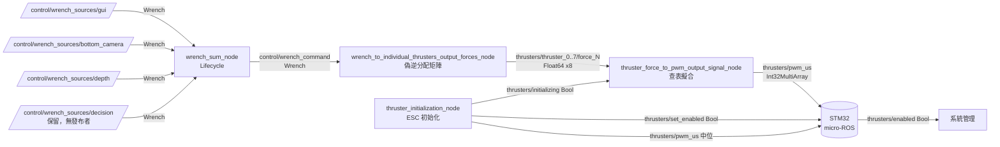
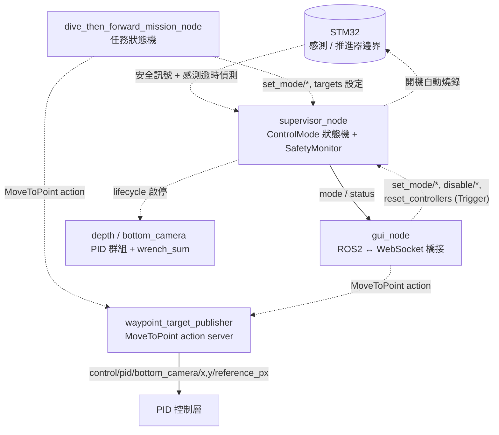

# SAUVC-RPI 架構文件（Architecture）

本文件說明 SAUVC-RPI 這個 ROS 2 workspace（`rpi_ros2_ws`）的系統架構，依邏輯分層（感知、控制、致動、系統管理）介紹各 package 的職責、node、topic、service、action 與訊息型別（message type），並補上每一層「為什麼這樣設計」的動機說明。環境安裝與啟動指令請參考 [README.md](../README.md)，這份文件專注在「系統怎麼運作」。

假設讀者已具備 ROS 2 基礎（node / topic / service / action / QoS / launch 系統），不會重新介紹這些概念；但對 Lifecycle Node、開迴路軌跡產生器（open-loop trajectory generator）這類本專案特有的設計，會補充設計動機。所有 topic 名稱皆為 remap 前、各 package 內宣告的相對名稱；執行時會依 `orca_bringup.launch.py` 的 remap，並包在 launch 的 `namespace` 參數（預設 `orca_auv`）之下，例如 `control/wrench_command` 實際上是 `/orca_auv/control/wrench_command`。

## 目錄

1. [專案總覽與硬體平台](#1-專案總覽與硬體平台)
2. [系統分層與核心設計：Wrench 匯流排](#2-系統分層與核心設計wrench-匯流排)
3. [感知層 Perception](#3-感知層-perception)
4. [控制層：PID 控制 Control](#4-控制層pid-控制-control)
5. [致動層：加總與分配 Aggregation & Allocation](#5-致動層加總與分配-aggregation--allocation)
6. [系統管理 System Management](#6-系統管理-system-management)
7. [訊息介面定義：xy_translation_control_interfaces](#7-訊息介面定義xy_translation_control_interfaces)
8. [感測器／推進器韌體介面邊界：SAUVC-STM32](#8-感測器推進器韌體介面邊界sauvc-stm32)
9. [模擬環境：SAUVC-Simulation](#9-模擬環境sauvc-simulation)
10. [建置與啟動流程](#10-建置與啟動流程)
11. [已知問題與待清理事項](#11-已知問題與待清理事項)

---

## 1. 專案總覽與硬體平台

Orca 是參加 SAUVC（Singapore AUV Challenge）的水下機器人（AUV, Autonomous Underwater Vehicle）。本 repo 是跑在**樹莓派（Raspberry Pi）**上的控制堆疊（control stack），透過序列埠與一顆 **STM32F4** 韌體板連接，兩者用 micro-ROS 串接進同一個 ROS 2 graph（STM32 端負責讀取壓力/IMU 感測器與輸出推進器 PWM，是本 repo 之外的獨立 submodule，見第 8 節）。

本 repo 涵蓋的範圍：底部相機視覺伺服（visual servoing）、深度定深（depth hold）、PID 控制、力的加總與推力分配（thrust allocation）、系統模式與安全管理、Web GUI。**不涵蓋**語意層級的物件偵測或任務規劃（不像姊妹 repo `SAUVC-JETSON` 有 YOLO 物件偵測與 Behavior Tree 決策層）——本 repo 目前唯一的自主任務邏輯是 `dive_then_forward_mission_node` 這一個顯式狀態機（見 6.4 節），`control/wrench_sources/decision` 這個 topic 是特意保留給未來高層決策模組的介面，目前沒有節點在發布。

## 2. 系統分層與核心設計：Wrench 匯流排

```
感知/感測層              控制層 Control                        致動層 Actuation                系統管理
──────────              ──────────────                        ──────────────                  ──────────
底部相機 → LK 光流   ┐                                                                          supervisor_node
STM32 壓力/IMU  ─────┼→ state/* → PID(depth/x/y/yaw) → wrench_sources/* → wrench_sum → 推力分配 → PWM → STM32   (Lifecycle 啟停
GUI 手動輸入     ────┘                                                                            + 安全門檻)
                                                                                                     ↑
                                                                                    gui_node / mission node 呼叫 service+action
```

| 層 | 對應 package | 角色 |
|---|---|---|
| 感知/感測 | `bottom_camera`, `xy_control`（`lk_total_transform_node`）, `depth_control`（轉接節點） | 相機影像追蹤、感測器格式轉換 |
| 控制 | `control`（通用 PID）, `xy_control`, `depth_control` | 把回饋誤差轉成力/力矩 |
| 致動 | `wrench_sum`, `thrusters` | 力的加總、6-DOF → 8 推進器分配、PWM 輸出 |
| 系統管理 | `system_manager`, `gui`, `stm32_manager` | 模式狀態機、安全門檻、Web 操作介面、韌體燒錄 |
| 介面定義 | `xy_translation_control_interfaces` | `MoveToPoint` action 定義 |

系統裡所有「想要移動載具」的來源（深度控制器、視覺伺服、GUI 手動操作），最終都只做一件事：發布一個 `geometry_msgs/Wrench`（力 `force.xyz` ＋ 力矩 `torque.xyz`，載具座標系）到自己專屬的 `control/wrench_sources/*` topic。`wrench_sum_node` 訂閱這些 topic 並相加成單一個 `control/wrench_command`，是後續唯一的下游輸入。這是整個系統最核心的設計決定：新增一種控制行為（例如避障或高層決策）只需要讓新節點發一個 Wrench topic 並在 `wrench_sum_node` 的 `input_topics` 參數加一行，不用碰任何下游程式碼；多個來源也可以同時貢獻力（例如同時做 depth hold 與 bottom camera hold），加總後自然疊加。細節與 timeout 機制見第 5 節。

---

## 3. 感知層 Perception

### 3.1 設計概念

這一層要解決的問題：把感測器的原始訊號轉成控制層可以直接當回饋（feedback）使用的格式。這裡沒有真正的物件偵測或建圖，而是兩條互相獨立的訊號路徑：

- **底部相機路徑**：`lk_total_transform_node` 用 LK 光流（Lucas-Kanade optical flow）在連續影像幀之間追蹤特徵點位移，換算成載具在水平面上的相對位移（x, y）與偏航角（yaw）變化——這是視覺里程計（visual odometry）的簡化版本，不需要建圖，只要能持續提供局部的位置回饋讓 PID 控制器定位（position hold）即可。
- **STM32 感測路徑**：深度（壓力感測器）與姿態（IMU）都是韌體端量測完直接發布過來的，RPI 這邊只做型別轉接與格式轉換，不做濾波或感測器融合（sensor fusion）。

`float32_to_float64_converter_node` 存在的唯一原因是型別不匹配：壓力感測器韌體送出 `Float32`，但 PID 控制器的 reference/feedback 介面統一吃 `Float64`。與其讓每個 PID 節點各自處理轉型，不如在感測邊界做一次轉換，讓下游介面維持一致。

### 3.2 資料流



| 節點 | 訂閱 | 發布 |
|---|---|---|
| `bottom_camera_node` | —（V4L2 硬體） | `camera/bottom/image_raw` (`Image`) |
| `lk_total_transform_node` | `camera/bottom/image_raw` | `camera/bottom/pose_px` (`Float64MultiArray`)、`camera/bottom/pose_px/{x,y,yaw,scale}` (`Float64`)、`state/bottom_camera/yaw_rad` (`Float64`)、`camera/bottom/debug/tile_lines` (`Image`, 選) |
| `float32_to_float64_converter_node` | `sensors/depth_m` (`Float32`, STM32) | `state/depth_m` (`Float64`) |
| `imu_to_orientation_node` | `sensors/imu` (`Imu`, STM32) | `state/orientation` (`Quaternion`) |

---

## 4. 控制層：PID 控制 Control

> 只有一份實作 `generic_pid_controller_node`（`LifecycleNode`），靠 remap 複用成四個實例。通用介面：`control/pid/reference`（訂）、`control/pid/feedback`（訂）、`control/pid/output`（發）、`{node}/reset`（`std_srvs/Trigger`）。

### 4.1 設計概念

四軸控制器（深度、x、y、yaw）共用同一份 `generic_pid_controller_node`，靠 launch 檔 remap 出四個獨立實例，而不是寫四份幾乎一樣的 PID 程式碼。這代表看這張圖時，「哪個 topic 對應哪個實例」完全取決於 remap，程式碼本身看不出來——這也是為什麼下方表格要把每個實例 remap 後的實際名稱整理出來。為什麼是 `LifecycleNode` 而不是一般 `Node`，見第 6.2 節。

yaw 軸多一個 `yaw_reference_unwrapper_node` 是因為角度在 ±π 邊界不連續（179° 到 -179° 實際只差 2°，但數值上差了 358°）：若讓 PID 直接對原始角度值做差，遇到邊界會被誤判成要繞一大圈才能到，輸出會暴衝。unwrapper 把目標角度攤平成與目前角度連續的數值，PID 才能算出正確方向的最短誤差。

x/y/yaw 三個 PID 各自只輸出一個純量（力或力矩），要合成一個 `Wrench` 才能送進下一階段，這是 `bottom_camera_pid_bridge_node` 存在的原因：把 world-frame 的 x/y 力與 yaw 力矩組成單一 `Wrench`，並依姿態做限幅。

### 4.2 資料流



| Node（PID 實例） | reference（訂） | feedback（訂） | output（發） |
|---|---|---|---|
| `depth_pid_controller_node` | `control/targets/depth_m` | `state/depth_m` | `control/pid/depth/sink_force_N` |
| `x_coordinate_pid_controller_node` | `control/pid/bottom_camera/x/reference_px` | `control/pid/bottom_camera/x/feedback_px` | `control/pid/bottom_camera/x/force_world_N` |
| `y_coordinate_pid_controller_node` | `control/pid/bottom_camera/y/reference_px` | `control/pid/bottom_camera/y/feedback_px` | `control/pid/bottom_camera/y/force_world_N` |
| `yaw_angle_pid_controller_node` | `control/pid/bottom_camera/yaw/reference_rad` | `state/bottom_camera/yaw_rad` | `control/pid/bottom_camera/yaw/torque_Nm` |

| 輔助節點 | 訂閱 | 發布 |
|---|---|---|
| `yaw_reference_unwrapper_node` | `control/targets/bottom_camera/yaw_rad`、`state/bottom_camera/yaw_rad` | `control/pid/bottom_camera/yaw/reference_rad` |
| `bottom_camera_pid_bridge_node` | `.../{x,y}/force_world_N`、`.../yaw/torque_Nm`、`state/bottom_camera/yaw_rad` | `control/wrench_sources/bottom_camera` (`Wrench`) |
| `output_sink_force_to_output_wrench_node` | `control/pid/depth/sink_force_N`、`state/orientation` | `control/wrench_sources/depth` (`Wrench`) |

Service（每個 PID 實例各一）：`{node_name}/reset` (`std_srvs/Trigger`)、`{node_name}/change_state`、`{node_name}/get_state`（lifecycle）。

---

## 5. 致動層：加總與分配 Aggregation & Allocation

### 5.1 設計概念

延續第 2 節的 Wrench 匯流排設計：每個來源有獨立的 timeout（`source_timeout_s`，預設 0.5 秒）——來源斷線或停止發布時，該來源的貢獻會被歸零而不是保留最後一次的殘留力，避免載具在感測器斷線後仍被舊的力矩推著跑。

`wrench_command` 是 6 自由度（6-DOF）的合力／合力矩，但實際能操縱的是 8 顆各自只能輸出一維推力的推進器——`wrench_to_individual_thrusters_output_forces_node` 用推力分配矩陣（thrust allocation matrix，取偽逆 pseudo-inverse）解這個問題，把 6 維目標解算成 8 顆推進器各自該出多少力。推進器不接受「力」這個單位，只接受 PWM 訊號，所以還要再經過 `thruster_force_to_pwm_output_signal_node` 查表（推進器廠商提供的力-PWM 對照曲線，`thruster_lookup_table.py`）擬合出對應脈寬。

`thruster_initialization_node` 存在的原因是 ESC（電子變速器）開機時需要先持續收到中位 PWM 訊號一段時間才會完成解鎖（arming）；如果開機直接送任意力對應的 PWM，ESC 可能無法正確初始化。這個節點鎖住 `thrusters/initializing`，讓下游暫時只輸出中位訊號，直到初始化序列跑完。

### 5.2 資料流



| Topic / Service | 型別 | 發布 | 訂閱 |
|---|---|---|---|
| `control/wrench_sources/{gui,bottom_camera,depth,decision}` | `Wrench` | 各控制來源 | `wrench_sum_node` |
| `control/wrench_command` | `Wrench` | `wrench_sum_node` | `wrench_to_individual_thrusters_output_forces_node` |
| `thrusters/thruster_{0..7}/force_N` | `Float64` | `wrench_to_individual_thrusters_output_forces_node` | `thruster_force_to_pwm_output_signal_node` |
| `thrusters/pwm_us` | `Int32MultiArray` | `thruster_force_to_pwm_output_signal_node`、`thruster_initialization_node` | STM32 |
| `thrusters/initializing` | `Bool` | `thruster_initialization_node` | `thruster_force_to_pwm_output_signal_node` |
| `thrusters/set_enabled` | `Bool` | `thruster_initialization_node` | STM32 |
| `thrusters/enabled` | `Bool` | STM32 | `supervisor_node`（安全） |
| `thrusters/{name}/initialize`、`thrusters/initialize_all` | `std_srvs/Trigger` | service：`thruster_initialization_node` | — |

`wrench_sum_node` lifecycle service：`change_state`、`get_state`（由 supervisor 控制啟停；每來源 `source_timeout_s` 逾時歸零）。

---

## 6. 系統管理 System Management

### 6.1 設計概念

`supervisor_node` 是整個系統唯一決定「現在該讓哪些控制器運作」的地方，它把安全前提（kill switch、感測器是否逾時、推進器是否已啟用）跟控制器本身的邏輯完全切開：PID 控制器完全不知道 kill switch 存在，它只回應標準的 ROS 2 Lifecycle 狀態轉換（`configure`／`activate`／`deactivate`）；supervisor 才是那個決定「現在允許哪些節點進入 active」的角色。好處是新增一種安全條件只需要改 supervisor 一處，不用逐一修改每個控制器。

`gui_node` 本質上是一個 ROS 2 ↔ WebSocket 的通用橋接器，把瀏覽器操作轉呼叫 supervisor 的 service、發布手動 Wrench、訂閱狀態 topic 轉發顯示，讓操作者不需要另外裝 ROS 2 環境就能監控與操作載具。

`MoveToPoint` action 的設計是開迴路（open-loop）軌跡產生器：`waypoint_target_publisher` 收到目標點後不管載具實際有沒有到，只是以固定速度把目標內插成一連串逐漸逼近的 setpoint 發布出去；真正「有沒有追上」是下游的 x/y PID controller 用相機回饋去追這個逐漸移動的 setpoint 完成的。換句話說，閉迴路（closed loop）發生在 PID 那一層，action server 只負責產生平滑的參考軌跡——這也是為什麼 `dive_then_forward_mission_node` 這種任務節點完全不用碰 `Wrench` 或 PID 增益，只需要呼叫 supervisor 的 service 與 `MoveToPoint` action。

### 6.2 為什麼用 Lifecycle Node

如果只熟悉一般的 rclpy `Node`，這是本專案裡最值得花時間理解的部分。`generic_pid_controller_node`（PID 控制器）和 `wrench_sum_node`（加總器）都繼承自 `rclpy.lifecycle.LifecycleNode`，而不是一般的 `Node`。Lifecycle Node 是 ROS 2 內建的受管理節點模型，有標準狀態機：

```
unconfigured → (configure) → inactive → (activate) → active
                                  ↑___________(deactivate)___|
```

節點在 `inactive` 狀態時仍然存在、可以被查詢，但不做實際工作（PID 控制器不累積積分項、不輸出；`wrench_sum_node` 不加總、不發布）；只有進入 `active` 才開始運作。相較於在一般 Node 裡用自訂旗標（例如 `self._enabled`）判斷要不要輸出，Lifecycle Node 的好處是狀態轉換是標準化的 service 介面（`~/change_state`、`~/get_state`），外部工具（`ros2 lifecycle`、以及本專案的 `supervisor_node`）可以用同一套邏輯管理任何 lifecycle 節點，不用替每個節點寫特製的啟停邏輯。

### 6.3 `supervisor_node`：中央狀態機

`system_manager/supervisor_node` 維護一個獨立於任何 lifecycle 狀態機之外的高層模式：

```python
class ControlMode(Enum):
    SAFE_DISABLED
    MANUAL
    DEPTH_HOLD
    BOTTOM_CAMERA_HOLD
    DEPTH_AND_BOTTOM_CAMERA_HOLD
    FAULT
```

它把 controller 分成「群組」（`controller_groups.py` 裡的 `ControllerGroupManager`）：

| 群組名稱 | 成員 node |
|---|---|
| `depth_control` | `depth_pid_controller_node` |
| `bottom_camera_pid_fbc` | `x_coordinate_pid_controller_node`、`y_coordinate_pid_controller_node`、`yaw_angle_pid_controller_node` |
| `wrench_sum`（內部群組，只要任一上述群組 active 就跟著 active） | `wrench_sum_node` |

當外部（GUI 或 mission node）呼叫 `system_manager/set_mode/depth_hold` 這類 service 時，`supervisor_node`（`supervisor_node.py`）會：

1. 呼叫 `SafetyMonitor` 檢查安全前提（kill switch 沒有觸發、推進器已啟用、對應的感測器資料沒有逾時，逾時門檻 `depth_sensor_timeout_s` / `bottom_camera_timeout_s` 各自可調，預設 1 秒）。
2. 若通過，對該群組的每個 node 呼叫 `.../reset` service（歸零 PID 積分項等內部狀態），再把它們 lifecycle enable（`configure` → `activate`）。
3. 同步確保 `wrench_sum_node` 進入 `active`（只要有任何一個 controller 群組是 active，就需要它運作）。
4. 用一個 0.2 秒週期的 timer 持續重新檢查目前 active 群組的安全條件（`_check_active_mode_safety`）；一旦某個安全前提被打破（例如深度感測器資料變 stale、kill switch 觸發、推進器被停用），立刻把所有 controller 群組 lifecycle disable 並進入 `FAULT` 模式，不需要外部再呼叫任何 service。另一個同週期 timer 負責把目前模式／狀態文字廣播到 `system_manager/mode`、`system_manager/status`。

這個設計把「安全門檻」與「controller 邏輯本身」完全解耦：PID 節點完全不知道 kill switch 或感測器逾時這些事，它只回應 lifecycle transition；「什麼時候允許 active」這個決策全部集中在 `supervisor_node` 一個地方。

### 6.4 案例研究：`dive_then_forward_mission_node`

這個節點示範了以上所有積木怎麼被組合成一個「無人自主任務」，是理解整個架構如何被使用的最佳範例。它是一個**顯式有限狀態機**（`MissionState`，用 `Enum` 定義約 19 個狀態，而不是 behavior tree 或其他框架），流程大致是：

1. `CALL_RESET_BOTTOM_CAMERA_POSE` / `CALL_RESET_MOVE_TO_POINT`：呼叫對應的 reset service，確保從乾淨狀態開始。
2. `CALL_DEPTH_HOLD`：呼叫 `system_manager/set_mode/depth_hold`，並發布目標深度到 `control/targets/depth_m`。
3. `WAIT_REACH_DEPTH`：訂閱 `state/depth_m`，等深度誤差在容忍範圍內並穩定一段時間。
4. `CALL_BOTTOM_CAMERA_HOLD` → `SEND_MOVE_GOAL`：呼叫 `system_manager/set_mode/bottom_camera_hold`，接著送一個 `MoveToPoint` action goal（往 +X 方向前進固定像素距離）。
5. `MOVING` → `WAIT_FORWARD_HOLD_STABLE`：等 action 完成，並確認位置穩定。
6. `PREPARE_TURN` → `WAIT_REACH_TURN_YAW`：分階段（staged）調整 yaw 目標，轉向。
7. `CALL_DISABLE_DEPTH_HOLD` → `DONE`。

任何一步逾時或失敗都會轉到 `FAILED` 狀態。這個節點完全不直接碰 `Wrench`、PID 增益或任何底層細節——它只是 `supervisor_node` 的 service client 加上 `MoveToPoint` 的 action client，證明了 6.1/6.3 節「把安全/模式邏輯集中在 supervisor，其餘節點只管呼叫標準介面」的設計確實達到了任務邏輯與控制邏輯解耦的效果。

### 6.5 資料流與介面表



| Interface | 型別 | 提供 / 發布 | 說明 |
|---|---|---|---|
| `system_manager/mode` | `String`（發布） | `supervisor_node` | 目前 `ControlMode`，0.2 s 廣播 |
| `system_manager/status` | `String`（發布） | `supervisor_node` | 人類可讀狀態 |
| `system_manager/set_mode/{safe_disabled,manual,depth_hold,bottom_camera_hold}` | `Trigger`（service） | `supervisor_node` | 切模式 / 啟用群組 |
| `system_manager/disable/{depth_hold,bottom_camera_hold}` | `Trigger`（service） | `supervisor_node` | 停用群組 |
| `system_manager/reset_controllers` | `Trigger`（service） | `supervisor_node` | 廣播 reset |
| `sensors/killed` | `Bool`（訂閱） | STM32 | kill switch |
| `{node}/change_state`、`{node}/get_state` | `lifecycle_msgs`（client） | `supervisor_node` | 對各 lifecycle node |
| `/flash_stm32` | `Trigger`（service） | `stm32_flasher_node` | 韌體燒錄（開機可自動，見第 8 節） |

**GUI（`gui_node`）額外角色**：發布 `control/wrench_sources/gui`（手動 wrench）；訂閱 `system_manager/mode`、`/status`、`camera/bottom/pose_px`、`state/depth_m` 轉發前端；透過 `rcl_interfaces` Get/SetParameters 即時調 PID 增益；`MoveToPoint` action client。影像串流由獨立 `web_video_server` 提供 MJPEG，不走 WebSocket。

---

## 7. 訊息介面定義：`xy_translation_control_interfaces`

感知/控制層與任務層之間唯一的自訂訊息定義，無 node，只有 `MoveToPoint.action`：

```
# Goal
float64 x_px
float64 y_px
float64 speed_px_s
---
# Result
bool success
string message
---
# Feedback
float64 target_x_px
float64 target_y_px
float64 progress
float64 remaining_distance_px
```

Action 名稱：`control/targets/move_to_point`。server 為 `waypoint_target_publisher`；client 有兩個：`gui_node`（操作者手動點目標）與 `dive_then_forward_mission_node`（見 6.4 節）。設計動機見 6.1 節「開迴路軌跡產生器」。

---

## 8. 感測器／推進器韌體介面邊界：SAUVC-STM32

獨立 submodule（`SAUVC-STM32`，STM32F4），透過 `micro_ros_agent`（serial transport）與本 repo 的 ROS 2 graph 串接，是唯一的橋樑。本文只列邊界介面，不深入韌體實作（`MS5837.c` 壓力感測器驅動、`kill_switch_*`、`thruster_pwm_*` 等）。

**韌體 → RPI（graph 裡完全沒有節點發布，資料源頭是韌體）**：

- `sensors/depth_m`（`std_msgs/Float32`）
- `sensors/imu`（`sensor_msgs/Imu`）
- `sensors/killed`（`std_msgs/Bool`）
- `thrusters/enabled`（`std_msgs/Bool`）

**RPI → 韌體（ROS 2 graph 發布，預期被韌體訂閱）**：

- `thrusters/pwm_us`（`std_msgs/Int32MultiArray`，8 顆推進器 PWM）
- `thrusters/set_enabled`（`std_msgs/Bool`）

`/flash_stm32`（`std_srvs/Trigger`，`stm32_manager` 提供）是燒錄用的控制介面，不是即時資料流；`supervisor_node` 開機時依 `auto_flash_stm32_on_startup` 參數決定要不要自動呼叫。韌體 repo 裡還有 `electromagnet_controller.c` 等模組，但目前沒有對應的 ROS 2 topic 接進本 repo，屬於韌體端尚未串接的功能，不在本文討論範圍。

---

## 9. 模擬環境：SAUVC-Simulation

獨立 submodule，提供 Gazebo 場景。本 repo 透過 `rpi_ros2_ws/src/launch/simulation_control.launch.py` 這個獨立 launch 檔切換到模擬模式，與正常的 `orca_bringup.launch.py` 差異在於：

- **拿掉硬體專屬節點**：不啟動 `bottom_camera_node`（相機驅動）、`micro_ros_agent`、`stm32_flasher_node`、`thruster_force_to_pwm_output_signal_node`／`thruster_initialization_node`——這些硬體 I/O 交給 `SAUVC-Simulation` repo 裡的 `ros_gz_bridge` 對接 Gazebo。`lk_total_transform_node` 改吃模擬相機的 `image_topic` 參數。分配層只到 `wrench_to_individual_thrusters_output_forces_node`（輸出每顆推進器的力），不再轉 PWM。
- **放寬安全門檻**：`supervisor_node` 的 `require_not_killed`、`require_thrusters_enabled`、`auto_flash_stm32_on_startup` 都設為 `False`，因為模擬環境沒有實體 kill switch 與 ESC 需要等待初始化。

其餘節點（`xy_control`、`depth_control`、`wrench_sum`、`gui`）與實機共用同一份程式碼，只換 launch 參數，不用重新編譯。

