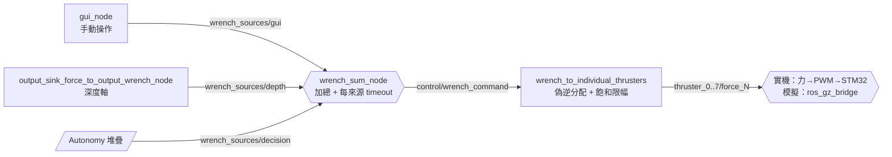

# 架構文件（Architecture）

本文說明這個 ROS 2 workspace（`rpi_ros2_ws`）**怎麼運作**：各 package 的職責、
node、topic、service、訊息型別，以及每一層「為什麼這樣設計」。安裝與啟動指令
在 [README.md](../README.md)。

假設讀者具備 ROS 2 基礎（node / topic / service / QoS / launch）；對 Lifecycle
Node、wrench 匯流排這類本專案特有的設計會補充動機。

所有 topic 名稱皆為 remap 前的相對名稱，執行時包在 launch 的 `namespace` 參數
（預設 `orca_auv`）之下 —— 例如 `control/wrench_command` 實際上是
`/orca_auv/control/wrench_command`。

## 目錄

1. [定位與邊界](#1-定位與邊界)
2. [核心設計：wrench 匯流排](#2-核心設計wrench-匯流排)
3. [感測層 sensors](#3-感測層-sensors)
4. [控制層 control / depth_control](#4-控制層-control--depth_control)
5. [致動層 wrench_sum / thrusters](#5-致動層-wrench_sum--thrusters)
6. [系統管理 system_manager](#6-系統管理-system_manager)
7. [操作介面 gui](#7-操作介面-gui)
8. [啟動與設定 orca_bringup](#8-啟動與設定-orca_bringup)
9. [外部邊界](#9-外部邊界)
10. [已知問題](#10-已知問題)

---

## 1. 定位與邊界

這個 repo 是 Orca AUV 的**載具控制堆疊**：把「目標」變成「推進器出力」。

它**不做**物件偵測、不做任務規劃 —— 那些在姊妹 repo `SAUVC-JETSON`
（感知 + BehaviorTree 決策，本文以下稱 Autonomy 堆疊）。兩者跑在同一塊
Jetson Orin NX 上的兩個獨立 container，只透過 ROS 2 topic 溝通。

維持兩個 container 而非合併的理由：base image 無法調和（CUDA devel + Isaac ROS
全家桶 vs 乾淨的 `ros:humble`）；改動頻率差距極大（控制堆疊天天調參，Isaac
映像半年不動）；故障隔離（感知 OOM / GPU 異常不該拖垮推進器控制）。

**外部介面**（本 repo 是訂閱端）：

| Topic | 型別 | 來源 |
|---|---|---|
| `control/wrench_sources/decision` | `geometry_msgs/Wrench` | Autonomy 決策，50 Hz |
| `control/targets/depth_m` | `std_msgs/Float64` | Autonomy 決策 或 GUI |

> **跨 container 通訊的前提**：兩邊的 `RMW_IMPLEMENTATION`、`ROS_DOMAIN_ID`
> 與 DDS transport 必須一致。特別是 `FASTDDS_BUILTIN_TRANSPORTS=UDPv4` ——
> 少了它，Fast DDS 會宣告共享記憶體 locator，而兩個 container 的 `/dev/shm`
> 視野不同，participant 會 match 到但資料永遠走不通，**且完全不報錯**。
> 設定收斂在 [`.env`](../.env)。

---

## 2. 核心設計：wrench 匯流排

系統裡所有「想要移動載具」的來源，最終都只做一件事：發布一個
`geometry_msgs/Wrench`（力 `force.xyz` ＋ 力矩 `torque.xyz`，載具座標系）
到自己專屬的 `control/wrench_sources/*`。



這是整個系統最核心的設計決定。新增一種控制行為只需要讓新節點發一個 Wrench
topic、並在 `orca_params.yaml` 的 `input_topics` 加一行，**不用碰任何下游程式碼**；
多個來源也可以同時貢獻力，加總後自然疊加（例如深度定深 + 自主前進）。

每個來源有獨立的 `source_timeout_s`（預設 0.5 秒）：來源斷線或停止發布時，
該來源的貢獻歸零而不是保留最後一次的殘留力，避免載具在感測器斷線後仍被舊力
推著跑。

---

## 3. 感測層 `sensors`

把韌體送來的原始訊號轉成控制層可以直接當回饋使用的格式。這裡不做濾波，
也不做感測器融合。

| 節點 | 訂閱 | 發布 | 存在理由 |
|---|---|---|---|
| `float32_to_float64_converter_node` | `sensors/depth_m` (`Float32`) | `state/depth_m` (`Float64`) | 型別不匹配：韌體送 `Float32`，PID 介面統一吃 `Float64`。與其讓每個 PID 各自處理轉型，不如在感測邊界做一次 |
| `imu_to_orientation_node` | `sensors/imu` (`Imu`) | `state/orientation` (`Quaternion`) | 只取姿態，丟掉角速度與加速度 |

這兩個節點原本放在 `depth_control` 裡，但它們與深度控制無關 —— 一個是通用型別
轉換，一個是姿態。歸入感測層才符合它們實際的職責。

---

## 4. 控制層 `control` / `depth_control`

### 4.1 通用 PID

只有一份實作 `generic_pid_controller_node`（`LifecycleNode`），靠 launch 的
remap 複用成具名實例。通用介面：

| 介面 | 型別 |
|---|---|
| `control/pid/reference`（訂） | `Float64` |
| `control/pid/feedback`（訂） | `Float64` |
| `control/pid/output`（發） | `Float64` |
| `{node_name}/reset`（service） | `std_srvs/Trigger` |

目前只有一個實例：

| 實例 | reference | feedback | output |
|---|---|---|---|
| `depth_pid_controller_node` | `control/targets/depth_m` | `state/depth_m` | `control/pid/depth/sink_force_N` |

> 光流退場後，x / y / yaw 三軸的視覺伺服 PID 一併移入 `legacy/`。
> yaw 目前是全開迴路（由 Autonomy 的 wrench 直接驅動）。若要補 yaw-hold，
> 複用同一份 `generic_pid_controller_node` 即可，但需先決定 yaw 的權威來源
> 是 STM32 IMU 還是飛控 IMU。

**增益每個控制迴圈重新讀取**，所以 `ros2 param set` 立即生效。這是池邊調參的
命脈，不要為了效能改成快取。

**積分抗飽和與輸出限幅**（`integral_limit` / `output_limit`，`<= 0` 代表停用）：
載具觸底、卡住或浮力沒配平時誤差會恆定不為零，積分項就無上界地線性成長。
模擬實測過：目標深度設在池底以下，45 秒內下沉力從 32 N 爬到 119 N 而且還在爬；
此時就算把目標改淺，也要幾十秒讓積分吐完才會反應，中間會劇烈上浮超調。
`integral_limit` 限制的是積分項的**輸出貢獻**（單位與 `output_limit` 一致，
都是牛頓），觸限時同步把內部累加值倒算回邊界。

### 4.2 深度力 → wrench

`output_sink_force_to_output_wrench_node` 把 PID 的純量輸出加上
`depth_force_bias_N`（抵銷淨浮力的常數偏壓），組成 `Wrench` 發到
`control/wrench_sources/depth`。

`use_sink_force_direction` 開啟時會依 `state/orientation` 把下沉力轉到載具座標系
（載具傾斜時仍垂直向下）；關閉時直接當作 `+z`。預設關閉。

### 4.3 為什麼用 Lifecycle Node

`generic_pid_controller_node` 與 `wrench_sum_node` 繼承自 `LifecycleNode`：

```text
unconfigured → (configure) → inactive → (activate) → active
                                  ↑___________(deactivate)___|
```

節點在 `inactive` 時仍然存在、可以被查詢，但不做實際工作（PID 不累積積分項、
不輸出）。相較於在一般 Node 裡用自訂旗標，Lifecycle 的好處是狀態轉換是標準化的
service 介面，外部工具（`ros2 lifecycle`、本專案的 `supervisor_node`）可以用
同一套邏輯管理任何 lifecycle 節點，不用替每個節點寫特製啟停邏輯。

---

## 5. 致動層 `wrench_sum` / `thrusters`

### 5.1 加總

`wrench_sum_node`（Lifecycle）訂閱 `input_topics` 列出的所有來源，相加成單一
`control/wrench_command`。設定在 `orca_params.yaml`，**開機時讀取**（節點在建構時
就要建立訂閱），改了要重啟。

### 5.2 分配與飽和

`wrench_to_individual_thrusters_output_forces_node` 用推力分配矩陣（偽逆）
把 6 維目標解算成 8 顆推進器各自的出力。幾何來自 `hardware.yaml`
（`thruster_positions_m` / `thruster_directions`，每顆 3 個值展平成一維陣列，
因為 ROS 2 參數不支援巢狀陣列）。

**飽和限幅也在這裡**，而不是只在力→PWM 節點裡。原因：模擬路徑刻意跳過 PWM
轉換節點，限幅若只寫在那裡，模擬就完全沒有飽和行為，調出來的增益搬到實機會
對不上。放在兩條路徑的共同節點上，模擬與實機才有同一組飽和行為。

`saturation_mode`：

- `scale`（預設）—— 任一顆超限時全部等比例縮放。**保留指令方向**，載具只是變慢。
- `clip` —— 各自獨立截斷。會扭曲合力方向，載具往非預期方向偏。

### 5.3 力 → PWM（僅實機）

`thruster_force_to_pwm_output_signal_node` 查推進器廠商的力-PWM 對照曲線
（`thruster_lookup_table_16V.csv`）擬合出脈寬，發到 `thrusters/pwm_us`。
自己也有一道 clamp，作為最後防線。

`thruster_initialization_node` 存在的原因：ESC 開機時需要先持續收到中位 PWM
一段時間才會完成解鎖（arming）。它鎖住 `thrusters/initializing`，讓下游暫時
只輸出中位訊號，直到初始化序列跑完。

| Topic / Service | 型別 | 發布 | 訂閱 |
|---|---|---|---|
| `control/wrench_sources/{gui,depth,decision}` | `Wrench` | 各控制來源 | `wrench_sum_node` |
| `control/wrench_command` | `Wrench` | `wrench_sum_node` | 分配節點 |
| `thrusters/thruster_{0..7}/force_N` | `Float64` | 分配節點 | 力→PWM 節點 / `ros_gz_bridge` |
| `thrusters/pwm_us` | `Int32MultiArray` | 力→PWM 節點、初始化節點 | STM32 |
| `thrusters/initializing` | `Bool` | 初始化節點 | 力→PWM 節點 |
| `thrusters/set_enabled` | `Bool` | 初始化節點 | STM32 |
| `thrusters/enabled` | `Bool` | STM32 | `supervisor_node` |
| `thrusters/initialize_all` | `std_srvs/Trigger` | service：初始化節點 | — |

---

## 6. 系統管理 `system_manager`

`supervisor_node` 是整個系統唯一決定「現在該讓哪些控制器運作」的地方。它把
安全前提跟控制器邏輯完全切開：PID 控制器完全不知道 kill switch 存在，只回應
標準的 lifecycle 轉換；supervisor 才是決定「現在允許哪些節點進入 active」的角色。
好處是新增一種安全條件只需要改 supervisor 一處。

### 6.1 控制模式

```python
class ControlMode(Enum):
    SAFE_DISABLED
    MANUAL
    DEPTH_HOLD
    AUTONOMOUS
    AUTONOMOUS_AND_DEPTH_HOLD
    FAULT
```

`AUTONOMOUS` 放行的是 Autonomy 堆疊直接發到 wrench 匯流排的
`control/wrench_sources/decision`。它沒有自己的 lifecycle 節點 —— 只需要
`wrench_sum_node` 是 active，外加「決策來源還活著」這個安全前提。
`AUTONOMOUS` 與 `DEPTH_HOLD` 可以疊加。

> 在有這個模式之前，要讓決策層的指令到得了推進器，只能先進 `MANUAL`
> （語意矛盾，而且會關掉深度 PID）或 `DEPTH_HOLD`（順帶啟用深度 PID），
> 而且沒有任何機制確認決策來源還活著 —— Autonomy 掛掉時，`wrench_sum` 只會
> 靜默把該來源歸零，載具停住但沒有人知道為什麼。

### 6.2 安全檢查

`SafetyMonitor` 檢查的前提：

| 前提 | 參數 | 適用模式 |
|---|---|---|
| kill switch 未觸發 | `require_not_killed` | 全部 |
| 推進器已啟用 | `require_thrusters_enabled` | 全部 |
| 深度資料未逾時 | `depth_sensor_timeout_s` | `DEPTH_HOLD` |
| decision wrench 未逾時 | `decision_timeout_s` | `AUTONOMOUS` |

一個 0.2 秒週期的 timer 持續重新檢查目前 active 模式的安全條件。任一前提被打破
就立刻把所有 controller lifecycle disable、停掉 `wrench_sum`、進入 `FAULT`，
不需要外部再呼叫任何 service。另一個同週期 timer 把模式／狀態文字廣播到
`system_manager/mode` 與 `system_manager/status`。

### 6.3 介面

| Interface | 型別 | 說明 |
|---|---|---|
| `system_manager/mode` | `String`（發布） | 目前 `ControlMode`，0.2 s 廣播 |
| `system_manager/status` | `String`（發布） | 人類可讀狀態／FAULT 原因 |
| `system_manager/set_mode/{safe_disabled,manual,depth_hold,autonomous}` | `Trigger` | 切模式 |
| `system_manager/disable/{depth_hold,autonomous}` | `Trigger` | 停用單一群組 |
| `system_manager/reset_controllers` | `Trigger` | 廣播 reset（歸零積分項等） |
| `sensors/killed` | `Bool`（訂閱） | kill switch，來自 STM32 |
| `/flash_stm32` | `Trigger` | 韌體燒錄（`stm32_manager` 提供，開機可自動） |

---

## 7. 操作介面 `gui`

`gui_node` 是 ROS 2 ↔ WebSocket 的橋接器，讓操作者不需要另外裝 ROS 2 環境就能
監控與操作載具。

- 發布 `control/wrench_sources/gui`（手動 wrench）、`control/targets/depth_m`
- 訂閱 `system_manager/mode`、`/status`、`state/depth_m`、`thrusters/*` 轉發前端
- 透過 `rcl_interfaces` Get/SetParameters 即時調深度 PID 增益（池邊調參）
- 呼叫 supervisor 的模式切換 service、推進器初始化、STM32 燒錄

影像串流由獨立的 `web_video_server` 提供 MJPEG，不走 WebSocket。底部相機退場後，
串流來源預設指向 Autonomy 堆疊的 RealSense。

---

## 8. 啟動與設定 `orca_bringup`

所有 launch 與設定的唯一來源。

```text
orca_bringup/
├── launch/
│   ├── bringup.launch.py    # 唯一入口，sim:=true 切模擬
│   └── record.launch.py     # bag 錄製
└── config/
    ├── orca_params.yaml     # 控制參數（池邊調參動這份）
    ├── hardware.yaml        # 推進器幾何、出力上限、ESC 時序
    ├── sim_overrides.yaml   # 模擬疊加值
    └── record_topics.yaml   # bag 錄製清單
```

實機與模擬**共用同一個 launch 檔**，差異只有兩處：`sim=true` 時跳過硬體專屬
節點（micro-ROS agent、STM32 燒錄、ESC 初始化、力→PWM），並額外疊上
`sim_overrides.yaml`。這是刻意的 —— 舊架構是實機／模擬各一份 launch 檔，
兩邊已經開始各自漂移（`wrench_sum` 的來源清單就已經不一致）。

### 參數的 namespace 陷阱

params YAML 的 key 必須是**含 namespace 的完整節點名**。本專案的 namespace 是
launch 參數，所以一律用萬用字元：

```yaml
/**/depth_pid_controller_node:
  ros__parameters:
    proportional_gain: 40.0
```

寫錯的話參數**不會報錯**，只會靜默回落到節點內建預設值（PID 增益直接變 0）。
改完務必用 `make dump_params` 確認實際生效的值。

### 兩類參數

| 類別 | 行為 | 例子 |
|---|---|---|
| 熱調 | 每個控制迴圈重新讀取，`ros2 param set` 立即生效 | PID 四個增益、`integral_limit`、`output_limit`、`depth_force_bias_N` |
| 開機讀 | 建構時讀一次，改了要重啟 | `controller_loop_timer_period_s`、`wrench_sum` 的 `input_topics` / `publish_rate` / `source_timeout_s`、推進器幾何 |

---

## 9. 外部邊界

### 9.1 STM32 韌體（`SAUVC-STM32` submodule）

透過 `micro_ros_agent`（serial transport）接進同一個 ROS 2 graph。序列埠路徑
來自 `.env` 的 `ORCA_STM32_PORT`，**建議用 `/dev/serial/by-id/` 穩定路徑** ——
`/dev/ttyUSB*` 的編號會隨插拔順序改變。

**韌體 → 本 repo**：`sensors/depth_m` (`Float32`)、`sensors/imu` (`Imu`)、
`sensors/killed` (`Bool`)、`thrusters/enabled` (`Bool`)

**本 repo → 韌體**：`thrusters/pwm_us` (`Int32MultiArray`)、
`thrusters/set_enabled` (`Bool`)

### 9.2 模擬（`SAUVC-Simulation` submodule）

Gazebo Fortress + `ros_gz_bridge`。模擬時分配層只到「每顆推進器的力」為止，
`thrusters/thruster_{0..7}/force_N` 直接進 bridge。深度來自 Gazebo altimeter
經 `altimeter_to_pressure_sensor_node` 轉成 `sensors/depth_m`。

> **模擬的深度零點是載具出生位置，不是水面**（Gazebo altimeter 的
> `vertical_position` 是相對出生點的）。實機壓力計的零點是水面。
> 模擬調出來的 `depth_force_bias_N` 與絕對深度目標不能直接搬到實機。

---

## 10. 已知問題

以下是已確認、但不在本 repo 修的跨 repo 落差，記錄備查（完整分析見
[SIMULATION_FINDINGS.md](../../docs/SIMULATION_FINDINGS.md)）：

1. **單位落差。** Autonomy 的 `decision_params.yaml` 與程式碼預設差 100 倍
   （`move_above_max_surge` YAML 15.0 vs 程式碼 0.15），這些值乘上 `k_surge`
   後**直接當牛頓**進本 repo 的分配矩陣。實際後果：`BumpFlare` 約 20 N（合理），
   `GoToPose` 約 0.24 N（等於不動）。
2. **`heave` 無增益。** Autonomy 的 `wrench_adapter.cpp` 中 `force.z = heave`
   是唯一沒乘係數的軸。目前所有 BT 節點都未設定 heave 故恆為 0；一旦有人設定，
   它會直接對抗深度 PID，且兩者在 wrench 匯流排上靜默相加。
3. **機械臂通道斷開。** Autonomy 發布 `/orca/decision/arm` (`Int32`) 與
   `/orca/decision/hand` (`Bool`)，本 repo 沒有任何訂閱者，用的是完全不同的
   `actuators/electromagnet/enabled`。
4. **無回饋回 Autonomy。** Autonomy 設定 desired_depth 但從不知道實際深度。
5. **兩個獨立的 IMU 來源。** Autonomy 訂閱飛控 IMU（`/orca/imu/data`），
   本 repo 用 STM32 IMU（`sensors/imu`）。同一台載具上兩個 IMU 各餵各的消費者，
   彼此不知道對方存在。要補 yaw-hold 之前必須先決定權威來源。
6. ~~**namespace 硬編碼。**~~ 已修：Autonomy 的 `decision.launch.py` 改由
   `namespace` 參數推導 remap，`perception.launch.py` 展開 YAML 裡的 `$(ns)`，
   兩者的預設值都讀 `ORCA_NAMESPACE`。兩個 repo 現在都是參數化的。
7. **`wrench_sum` 的 `publish_rate` 名不副實。** `listener_callback` 收到任何
   來源就直接發布一次，同時 timer 也在發，實際輸出率是「timer 頻率 ＋ 所有輸入
   頻率總和」。設 30 Hz 實測約 130 Hz。
