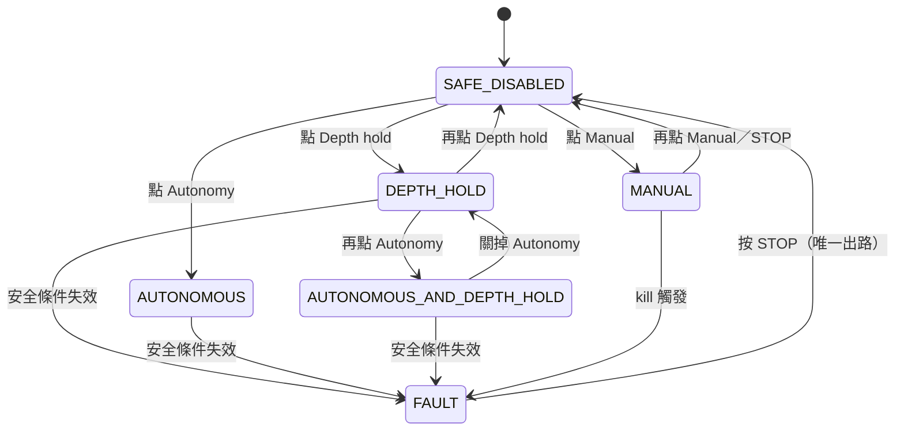

# ORCA 控制台操作手冊

寫給操作這個網頁的人：下水前的檢查、怎麼切模式、出事怎麼停、什麼時候該按哪個
reset。程式在 `rpi_ros2_ws/src/gui/`，模式規則在
`rpi_ros2_ws/src/system_manager/system_manager/supervisor_node.py`。

架構層面的「為什麼」看 [ARCHITECTURE.html](ARCHITECTURE.html)，這份只講「怎麼操作」。

---

## 0. 快速參考卡

| 我想做的事 | 怎麼做 |
|---|---|
| 立刻停下載具 | 按 **STOP**，或按 **Esc**（任何時候都有效，沒有確認視窗） |
| 用鍵盤手動開 | Flight → Vehicle mode → **Manual** |
| 定深、鍵盤微調深度 | Flight → Vehicle mode → **Depth hold**（不是 Manual） |
| 跑自主任務 | **Autonomy** 開啟後，按 **Start mission** |
| PID 積分爆掉、一直往下沉/往上衝 | **Reset controllers** |
| 清除 FAULT | 按 **STOP** |
| 沒有硬體想在桌上測 | Diagnostics → **Simulation safety bypass** 打開（下水前關掉） |

**最重要的一句**：畫面上的模式燈號是載具回報的事實，不是你點過什麼。點了沒亮 ＝
被拒絕了，看右下角的紅色提示。

---

## 1. 開啟頁面

先確認控制堆疊已啟動：

```bash
make launch_control
```

然後用瀏覽器開 **`http://<樹莓派 IP>/`**（就是 80 埠，不用加埠號；在載具本機上是
`http://localhost`）。

開起來先看右上角旁邊的 `Link` 標籤：

- **Link up**（綠）＝ 網頁跟 `gui_node` 通了。
- **Link down**（紅）＝ 沒通。頁面會自動重連（0.5 秒起、最多退到 5 秒一次），
  不用手動 F5。這時畫面上的數字全是舊的，**不要照著它做決定**。

相機影像走的是另一條路（`web_video_server`，8080 埠），所以
**Link up 但畫面全黑是正常的可能狀況** —— 代表控制通了、但相機節點沒發布。

---

## 2. 畫面導覽

### 頂欄（永遠看得到）

| 標籤 | 意思 |
|---|---|
| `MANUAL` / `DEPTH_HOLD` / … | 目前模式，載具回報的 |
| `DEPTH` | 目前深度（往下為正） |
| `TARGET` | 目標深度 |
| `Kill clear` / `Kill ACTIVE` | 實體 kill 開關 |
| `Thrusters on` / `off` | 推進器是否啟用 |
| `Link up` / `down` | 網頁連線 |
| `Bag REC` / `Bag idle` | 是否正在錄 bag |
| **STOP** | 緊急停止 |

**看到 `Kill —`、`Thrusters —`（破折號）要當心**：那不是「正常」，是「**還沒收到過
狀態**」。這種狀態下切模式一定會被拒絕（見 §4）。

深度數字旁邊出現 `STALE` ＝ 那個值超過時限沒更新（深度 1.5 秒、目標深度 8 秒），
數字還在但已經不可信。

### 三個分頁

- **Flight** —— 平常操作都在這裡：相機、模式、深度目標、任務、電磁鐵、鍵盤。
- **Tuning** —— 深度 PID 參數、鍵盤力道、手動 wrench 單發。
- **Diagnostics** —— 推進器 PWM 直寫、STM32 燒錄、錄製狀態、模擬安全繞過。
  **這一頁的東西會繞過安全機制**，見 §9。

---

## 3. 模式是怎麼運作的

六種模式。Depth hold 和 Autonomy 是**可以疊加**的；Manual 是**互斥**的，一進去
就把其他控制器全關掉。



| 模式 | 深度 PID | 鍵盤能開 | 說明 |
|---|:---:|:---:|---|
| `SAFE_DISABLED` | 關 | ✗ | 待命，推力歸零。開機預設 |
| `MANUAL` | **關** | ✓ | 純手開。Q/E 改得動目標深度，但沒人去追它 |
| `DEPTH_HOLD` | 開 | ✓ | **想手開又要定深，選這個**，不是 Manual |
| `AUTONOMOUS` | 關 | ✗ | 放行 Jetson 決策層的指令 |
| `AUTONOMOUS_AND_DEPTH_HOLD` | 開 | ✗ | 自主 + 定深 |
| `FAULT` | 關 | ✗ | 鎖存的故障，推力歸零 |

FAULT 是**鎖存**的：故障原因會顯示在模式標籤旁邊並且留在畫面上（不是跳一下就
消失的提示），因為那是載具為什麼停機的唯一紀錄。FAULT 時三個模式按鈕都會變灰，
**只能按 STOP 才出得來**。

---

## 4. 切換到手動模式

### 步驟

1. 切到 **Flight** 分頁。
2. 找到 **Vehicle mode** 面板（在右欄最上面，畫面捲太下去會看不到）。
3. 點 **Manual**。

成功的話：模式標籤變成黃色 `MANUAL`，Keyboard 面板右上角從 `inactive` 變成綠色
`active`，這時 WASD 才會動。

### 前置條件（不滿足就會被拒絕）

1. **Kill 開關沒觸發**，而且系統**已經收到過** kill 狀態
2. **推進器 enabled**，而且系統**已經收到過**推進器狀態

所以下水前的順序是：先確認頂欄的 `Kill clear` 和 `Thrusters on` 兩個都亮起來，
再點 Manual。

### 被拒絕怎麼辦

畫面右下角會跳紅色 `Rejected`，訊息就是原因：

| 訊息 | 意思 | 處理 |
|---|---|---|
| `Killed state is unknown` | 沒收到過 kill 狀態 | STM32／micro-ROS 沒連上，檢查序列埠 |
| `Thruster enabled state is unknown` | 沒收到過推進器狀態 | 同上 |
| `Killed` | kill 開關正被觸發 | 把實體開關放開 |
| `Thrusters are disabled` | 推進器沒啟用 | Diagnostics → Initialise all thrusters |
| `Supervisor service not ready` | supervisor 節點沒起來 | `make status` 看堆疊 |

**桌上測試沒有硬體時**：Diagnostics → **Simulation safety bypass** 打開，上面兩個
前置條件就會放寬。**下水前一定要關掉。**

### 關掉手動

再點一次 **Manual** —— 這會把載具送回 `SAFE_DISABLED`（不是留在某個中間狀態）。
按 STOP 效果一樣。

---

## 5. 鍵盤操作

Manual 或 Depth hold 之下有效（Keyboard 面板顯示 `active`）。

| 按鍵 | 動作 |
|---|---|
| `W` / `S` | 前進 / 後退 |
| `A` / `D` | 左平移 / 右平移 |
| `←` / `→` | 左轉 / 右轉 |
| `Q` / `E` | 目標深度 −／+（**往下為正，E 是變深**） |
| `Esc` | 緊急停止 |

- 可以同時按，`W`+`D` 就是斜著走。
- **游標在數字輸入框裡時鍵盤不會控制載具** —— 你在打參數，不是要它平移。
- **切走視窗或分頁會自動放開所有鍵**。否則按著 W 去按 alt-tab，載具會一直往前
  開而且你手上沒有可以放開的鍵。
- 力道在 **Tuning → Keyboard strength** 調（預設平移 20 N、偏航 10 Nm、
  深度每步 0.05 m），改完立即生效。

### Manual 和 Depth hold 的差別（最容易搞錯的地方）

在 **Manual** 下按 Q/E，`TARGET` 的數字會動，**但載具不會跟著變深** —— Manual 把
深度 PID 關掉了，沒有人去追那個目標值。頁面上會用黃字提醒這件事。

**要真的用鍵盤控制深度，請用 Depth hold**，WASD 一樣能開，Q/E 才會真的讓載具上下。

---

## 6. 設定目標深度

Flight → **Depth target** 輸入數字 → 按 **Set**。或用 Q/E 一步一步加減。

同樣的道理：**Depth hold 開著，PID 才會去追這個值。**

---

## 7. 三種 Reset，不要用錯

| 按鈕 | 做什麼 | 什麼時候用 |
|---|---|---|
| **Reset controllers**<br>（Vehicle mode 面板） | 清掉深度 PID 的**積分累積與微分歷史**。<br>**不改模式、不改目標深度、不停推力** | 載具卡住／被抓住一陣子後放開，PID 積分飽和，出現持續往下沉或往上衝的偏壓 |
| **STOP** 或 **Esc**<br>（右上角紅鈕） | 回到 `SAFE_DISABLED`：清掉所有控制器群組、停用深度 PID、切斷推力匯流排，**推力歸零** | 出任何狀況；**清除 FAULT 也是按這個** |
| **Initialise all thrusters**<br>（Diagnostics） | 重跑 ESC 解鎖序列 | 推進器沒反應、`Thrusters off` 一直不變 |

三者的差別一句話：**Reset controllers 只忘記歷史，STOP 停止一切，Initialise
重新喚醒硬體。**

網頁上**沒有**「重啟整個系統」的按鈕。真的要重啟：

```bash
make stop && make launch_control
```

---

## 8. 緊急停止

**STOP 按鈕，或鍵盤 Esc。** 沒有確認視窗 —— 需要按兩次的急停不算急停。

它會清空所有控制器群組、停用 PID、關掉推力匯流排，這是唯一能確實把推力歸零的
操作。之後載具停在 `SAFE_DISABLED`，要重新開始就再點想要的模式。

**唯一的例外**：Diagnostics 的直寫 PWM 不受模式管制，見下一節。

---

## 9. 其他功能

### Mission（Flight）

**Start mission** 對自主堆疊發出開始訊號。合理的順序是：先開 **Autonomy**（確認
模式標籤真的變了），再按 Start mission。

### Ball magnet（Flight）

**Hold** 吸住、**Release** 放開，標籤顯示目前是 `holding` 還是 `released`。

### 錄製（Diagnostics）

跟著堆疊自動開始，看得到 bag 名稱、大小、剩餘磁碟。

斷電後 bag 會少掉 `metadata.yaml`，讀不出來。先修：

```bash
ros2 bag reindex <bag 目錄> -s mcap
```

### ⚠️ Diagnostics 的危險項目

| 功能 | 風險 |
|---|---|
| **Publish PWM** | **繞過模式管制** —— 即使在 `SAFE_DISABLED` 載具也會動。手和工具離開螺旋槳 |
| **Flash firmware** | 重燒 STM32，過程中載具完全失控直到重開機完成 |
| **Simulation safety bypass** | 放寬 kill 與推進器檢查。**絕對不要在水中留著開啟** |

三個都有確認視窗（bypass 除外），但確認視窗擋不住手滑之後的後果。

---

## 10. 故障排除

| 症狀 | 可能原因 | 處理 |
|---|---|---|
| 點模式按鈕沒亮 | 被 supervisor 拒絕 | 看右下角紅色提示的原因，對照 §4 |
| 頂欄 `Kill —`、`Thrusters —` | 沒收到過硬體狀態 | micro-ROS agent／STM32 沒連上 |
| 模式變 `FAULT` 且不會自己好 | FAULT 是鎖存的 | 讀模式旁的原因 → 排除 → 按 STOP |
| 鍵盤沒反應 | 不在 Manual／Depth hold；或游標在輸入框裡 | 看 Keyboard 是否 `active`，點一下空白處 |
| Q/E 改了 TARGET 但載具不動 | 在 Manual，PID 是關的 | 改用 Depth hold |
| 相機黑畫面但 Link up | 相機走 8080 另一條路 | 檢查相機節點有沒有在發布 |
| 數字標 `STALE` | 該 topic 停止更新 | 檢查對應節點，不要照著舊數字操作 |
| 整頁 `Link down` | `gui_node` 掛了或網路斷 | 會自動重連；持續紅色就 `make status` |

---

## 附錄：按鈕對應到什麼（給工程師）

| 介面操作 | WebSocket 訊息 | 後端動作 |
|---|---|---|
| Manual 開 | `action: set_supervisor_manual_mode {enabled:true}` | `/system_manager/set_mode/manual` |
| Manual 關 | 同上 `{enabled:false}` | `/system_manager/set_mode/safe_disabled` |
| Depth hold 開／關 | `action: set_supervisor_depth_hold` | `set_mode/depth_hold`／`disable/depth_hold` |
| Autonomy 開／關 | `action: set_supervisor_autonomous_mode` | `set_mode/autonomous`／`disable/autonomous` |
| STOP／Esc | `action: safe_disable` | `/system_manager/set_mode/safe_disabled` |
| Reset controllers | `controller: {depth_control, reset}` | `/system_manager/reset_controllers` → `depth_pid_controller_node/reset` |
| Set（深度） | `topic: control/targets/depth_m` | publish `Float64` |
| WASD／方向鍵 | `topic: control/wrench_command` @20 Hz | publish 到 `control/wrench_sources/gui` |
| Start mission | `action: start_mission` | publish `/orca/decision/start_mission` |
| 電磁鐵 | `topic: actuators/electromagnet/enabled` | publish `Bool` |

前後端的協定契約寫成兩份、必須同步修改：
`gui/static/shared/protocol.js` 與 `gui/backend/protocol.py`。
